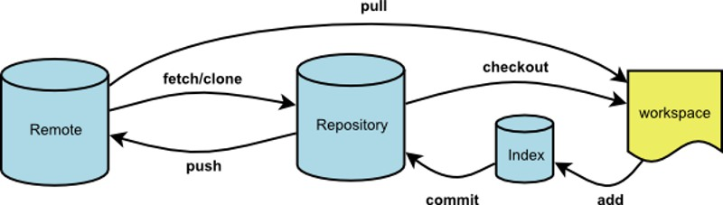

#GIT使用

##git的工作方式

 

* 本地（本地开发者自己存放的代码）
* 暂存（每次commit的时，生成Change-Id commit 等HEAD信息）
* 远程（将暂存区里的信息push到远程）

##工作流

你的本地仓库由 git 维护的三棵“树”组成。

* 第一个是你的 工作目录，它持有实际文件；
* 第二个是 暂存区（Index），它像个缓存区域，临时保存你的改动；
* 最后是 HEAD，它指向你最后一次提交的结果。

 

##流程

	git clone /path/to/repository  //执行如下命令以创建一个本地仓库的克隆版本
	git clone username@host:/path/to/repository  //远端服务器上的仓库
	git add <filename> || git add *  //你可以提出更改（把它们添加到暂存区）,这是 git 基本工作流程的第一步
	git commit -m "代码提交信息"  //实际提交改动;现在，你的改动已经提交到了 HEAD，但是还没到你的远端仓库
	git push origin master  //将这些改动提交到远端仓库;可以把 master 换成你想要推送的任何分支
	git remote add origin <server> //如果你还没有克隆现有仓库，并欲将你的仓库连接到某个远程服务器;如此你就能够将你的改动推送到所添加的服务器上去了

##分支

分支是用来将特性开发绝缘开来的。在你创建仓库的时候，master 是“默认的”分支。在其他分支上进行开发，完成后再将它们合并到主分支上。

 

	git checkout -b feature_x  //创建一个叫做“feature_x”的分支，并切换过去
	git checkout master //切换回主分支
	git branch -d feature_x  //再把新建的分支删掉
	git push origin <branch>  //除非你将分支推送到远端仓库，不然该分支就是 不为他人所见的

##更新与合并

	git pull //要更新你的本地仓库至最新改动,当远程分支有几个的时候，pull的时候需要选择pull那个远程分支的代码,有冲突不能pull
	git merge <branch>  //git 会尝试去自动合并改动，
	git add <filename>  //改完之后,将它们标记为合并成功
	git diff <source_branch> <target_branch>  //在合并改动之前，你可以使用如下命令预览差异

##标签

	git tag 1.0.0 1b2e1d63ff  //创建一个叫做 1.0.0 的标签
	git log  //获取提交 ID，查看提交历史,所谓的日志

##替换本地改动

	git checkout -- <filename>  //替换掉本地改动;此命令会使用 HEAD 中的最新内容替换掉你的工作目录中的文件。已添加到暂存区的改动以及新文件都不会受到影响。
	git fetch origin
	git reset --hard origin/master   //假如你想丢弃你在本地的所有改动与提交，可以到服务器上获取最新的版本历史，并将你本地主分支指向它

##实用小贴士

	git cherry-pick <commit 信息> //可以将一个分支的提交信息，更新到另一个分支里；这就可以在这个分支上提交另一个分支编写的代码
	git rebase develop //可以将develop上的改变更新到到当前操作的这个分支
	
	远程分支和本地分支是对应时，git会自动建立对应的关系；如新增本地分支，远程上面没有这个分支，对应关系不会建立，在没有将本地分支push到远程上的时候，是在远程上找不到对应的分支；也可以手动建立对应关系。

##修改本地git配置

	.git  ---->  config
	在remote fetch后插入push = refs/heads/*:refs/for/*  //简写push到具体路径的方法

##更多

[GIT参考-1](http://git-scm.com/book/zh/v1)

[GIT参考-2](http://rogerdudler.github.io/git-guide/index.zh.html)
